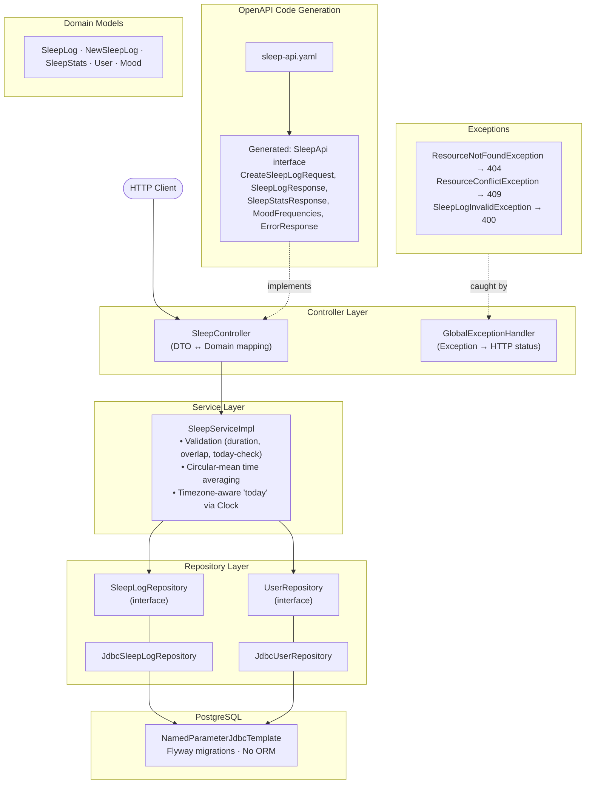
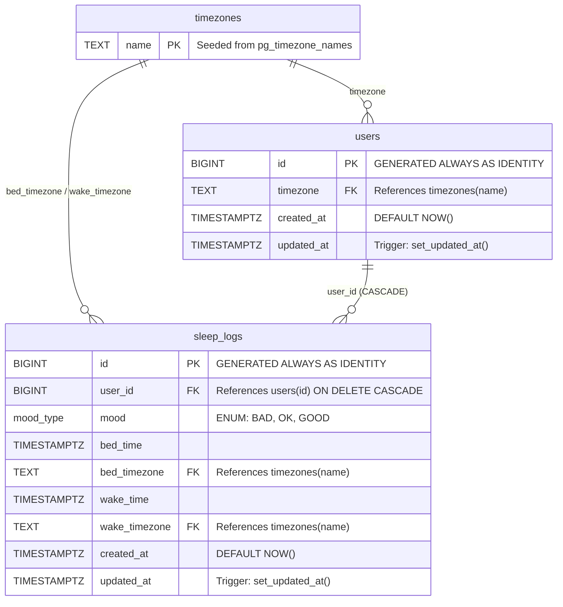
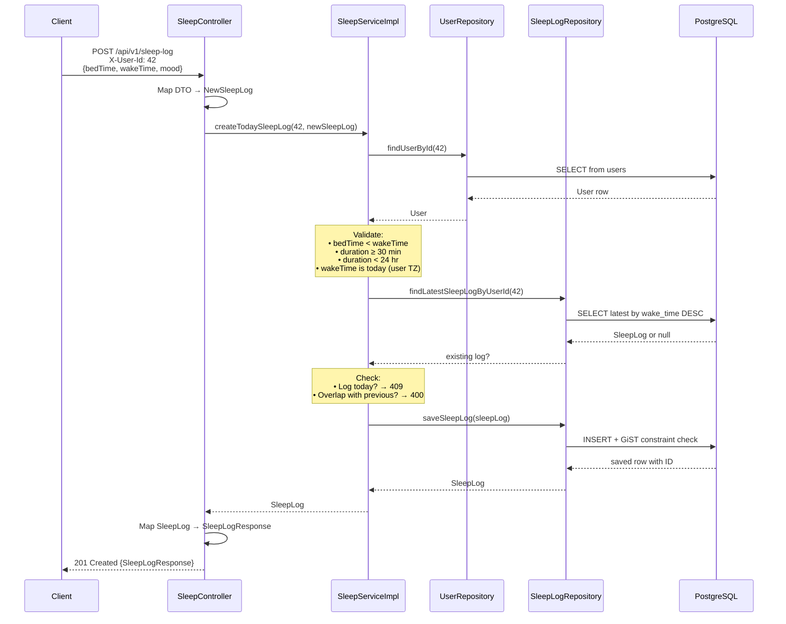

# Architecture

## Layer / Component Diagram

The API follows a classic layered architecture. The OpenAPI spec is the single source of truth for the HTTP contract —
the generator produces interfaces and DTOs that the controller implements directly.

## Database ER Diagram

PostgreSQL 13 with Flyway-managed migrations. The `timezones` table is a reference table seeded from
`pg_timezone_names`. The `sleep_logs` table uses a GiST exclusion constraint to prevent overlapping sleep ranges per
user at the database level.

**Constraints and indexes on `sleep_logs`:**

| Name                               | Type           | Detail                                                     |
|------------------------------------|----------------|------------------------------------------------------------|
| `wake_after_bed`                   | CHECK          | `wake_time > bed_time`                                     |
| `no_overlapping_sleep`             | EXCLUDE (GiST) | `(user_id WITH =, tstzrange(bed_time, wake_time) WITH &&)` |
| `idx_sleep_logs_user_id_wake_time` | INDEX          | `(user_id, wake_time DESC)`                                |

## Request Flow — Create Sleep Log

Traces `POST /api/v1/sleep-log` through all layers, showing the happy path and error branches.

**Error paths** (handled by `GlobalExceptionHandler`):

| Condition                      | Exception                         | HTTP Status |
|--------------------------------|-----------------------------------|-------------|
| User not found                 | `ResourceNotFoundException`       | 404         |
| Log already exists for today   | `ResourceConflictException`       | 409         |
| Invalid duration or times      | `SleepLogInvalidException`        | 400         |
| DB overlap constraint violated | `DataIntegrityViolationException` | 409         |
| Missing `X-User-Id` header     | `MissingRequestHeaderException`   | 400         |
